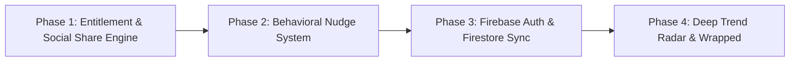

# 💎 Streakbox: Master Product Tiering, Architecture & Strategic Roadmap

---

## 🎯 Strategic Value Proposition: The 85% Free / 15% Pro Model

Streakbox operates on a **Pure Privacy, Zero-Ad, High-Retention Growth Loop**.
The core habit-tracking loop and viral social sharing are **100% Free and Ad-Free forever** to drive viral organic acquisition and long-term retention. Monetization is driven by an ultra-premium **15% Pro Tier** catering to power users, deep behavioral analytics, aesthetic purists, and multi-device cloud synchronization.

---

## ⚖️ Feature Tiering Matrix

| Feature Area | 🆓 85% Free Tier (Privacy-First & 100% Ad-Free) | 👑 15% Premium Tier (Streakbox PRO) |
| :--- | :--- | :--- |
| **Habit Tracking & Calendar** | • Unlimited habits & custom emojis<br>• Flexible frequencies (Daily, Weekly Target, Specific Days)<br>• Single-tap check-in & physical tactile UI<br>• **1 Free Grace Day / Month** (Ethical streak relief) | • **Habit Stacking & Atomic Chains** (Habit A triggers Habit B)<br>• **Unlimited Streak Freezes & Vacation Mode**<br>• Sub-task checklists per habit entry |
| **Visual Matrix & Analytics** | • 12-Month Zero-Scroll Interactive Heatmap<br>• Real-time Current & Best Streak counters<br>• Milestone Achievement Ladder | • **Deep Trend Radar & Day-of-Week Rhythm Analysis**<br>• Completion Velocity & Habit Correlation Matrix<br>• **Year-in-Review "Wrapped" Story**<br>• High-res Vector PDF & CSV Data Export |
| **Social Sharing & Virality** | • **100% Free**: High-res Instagram Story, WhatsApp & Twitter celebration cards with custom aesthetic themes | • Verified PRO Badge on share cards<br>• Custom branding watermark removal |
| **Behavioral Psychology Nudges** | • Standard fixed daily reminders with smart quiet hours | • **Trigger-Based Dynamic Nudges (Local & FCM)**:<br>  - *Loss Aversion*: "Day 29 of 30. Don't break your momentum tonight!"<br>  - *Momentum Booster*: "2 days away from beating your all-time record!"<br>  - *Implementation Intention*: Dynamic circadian timing |
| **Cloud Sync & Data Storage** | • **100% Local Privacy Vault** (SQLite/FFI)<br>• 1-Tap Encrypted JSON Backup & Restore | • **Realtime Firebase Cloud Sync** across iOS, Android & Desktop<br>• Dual Sign-In (Firebase Auth: Google + Apple + Anonymous Guest)<br>• Automated background Firestore snapshots |
| **Theme Engine & Aesthetics** | • Classic Obsidian Dark & Paper Clean presets<br>• Full system emoji picker with search | • **Tactile Neumorphic Nordic Noir & Ember Sunset**<br>• OLED Cyber Neon & Custom Palette Engine<br>• Exclusive app icons & animated milestone seals |

---

## 🔒 Privacy & Business Model Resolution: Why 100% Ad-Free?

> [!IMPORTANT]
> **Ad SDKs vs. Privacy Vault Resolution**:
> Ad networks inject heavy tracking SDKs that violate local-first privacy guarantees. Streakbox resolves this completely: **Zero Ads across all tiers**.
> The Free tier is a hyper-polished, trust-building acquisition funnel. Monetization relies entirely on **high-conversion Pro upgrades** driven by contextual paywalls, Wrapped moments, and power features.

---

## 🔥 Cloud Architecture: Firebase Ecosystem Integration

Leveraging Firebase accelerates delivery while preserving local-first performance:

```
┌─────────────────────────────────────────────────────────────┐
│                    Streakbox App Layer                      │
│   (Offline-First Local SQLite Vault + Riverpod Providers)   │
└──────────────┬──────────────────────────────┬───────────────┘
               │                              │
               ▼                              ▼
┌──────────────────────────────┐┌──────────────────────────────┐
│        Firebase Auth         ││   Cloud Firestore (Pro)      │
│  - Google Sign-In (Android)  ││  - Set-Union Date Sync       │
│  - Apple Sign-In (iOS)       ││    (FieldValue.arrayUnion)   │
│  - Anonymous Guest Upgrade   ││  - Multi-Device Live Stream  │
└──────────────────────────────┘└──────────────────────────────┘
               │                              │
               └──────────────┬───────────────┘
                              ▼
┌─────────────────────────────────────────────────────────────┐
│             Firebase Cloud Messaging & Analytics            │
│  - Automated Behavioral Push Nudges                         │
│  - Privacy-preserving Pro Conversion Funnel Tracking        │
└─────────────────────────────────────────────────────────────┘
```

### Key Technical Advantages of Firebase:
1. **Firebase Authentication**:
   - Supports **Google Sign-In** + **Sign in with Apple** (iOS Guideline 4.8 compliant).
   - Enables **Anonymous Guest Authentication** so new users track habits with 0 friction and upgrade to Cloud Pro with 1 tap without losing local data.
2. **Cloud Firestore (CRDT Set-Union Sync)**:
   - Uses `FieldValue.arrayUnion(...)` for calendar completion arrays, mathematically ensuring zero streak loss even with concurrent offline edits across phones and tablets.
3. **Firebase Cloud Messaging (FCM)**:
   - Powers dynamic psychological retention nudges when the app is closed.

---

## 💳 Pricing Strategy & Conversion Mechanics

| Plan | Price | Trial / Intro Period | Target Audience |
| :--- | :--- | :--- | :--- |
| **Monthly Pro** | **$2.99 / mo** | 3-day free trial | Short-term goal sprints |
| **Annual Pro (Flagship)** | **$19.99 / yr** *(Save 44%)* | **7-day free trial** + 48h frictionless in-app test drive | Long-term habit builders |
| **Lifetime Founder** | **$49.99 one-time** | N/A (Limited early-adopter badge) | Power users & privacy advocates |

### High-Conversion Paywall Trigger Moments:
1. **The "Theme & Polish" Trigger**: Instant 1-tap 48-Hour Free Trial when tapping flagship themes (*Nordic Noir*, *Ember Sunset*).
2. **The "Streak Rescue" Moment**: Prompted when a user returns after missing a day to offer a Streak Freeze.
3. **The "Milestone Milestone" Moment**: Triggered upon hitting 7, 21, or 30-day streak milestones.
4. **The "Annual Wrapped" Moment**: Seasonal year-end interactive habit story.

---

## 🗺️ Execution Roadmap (Optimized Sequencing)



### Phase 1: 👑 Entitlement Engine & 📱 Social Share Matrix *(Current Focus)*
- **Entitlement & Pro State Machine**: Build `proStateProvider` with trial timers, feature gating flags, and non-intrusive paywall preview bottom sheets.
- **Viral Snapshot Studio**: High-res Instagram Story (9:16) & Twitter (16:9) card generator utilizing `RepaintBoundary` with tactile theme rendering, dynamic streak flame, and native sharing.

### Phase 2: 🔔 Behavioral Psychology Notification Engine
- Local background alarm scheduler using exact alarms & battery-optimized wake locks.
- Loss Aversion, Momentum Booster, and Implementation Intention nudge algorithms.

### Phase 3: 🔥 Firebase Cloud Sync & Authentication (Google + Apple)
- Firebase Auth: Google Sign-In, Sign in with Apple, and Anonymous Guest account linking.
- Firestore: Realtime bidirectional CRDT Set-Union sync with offline persistence.

### Phase 4: 📊 Deep Analytics Radar & Year-in-Review "Wrapped"
- Polar chart habit correlation radar, day-of-week rhythm analysis, and exportable high-res vector PDF summaries.
