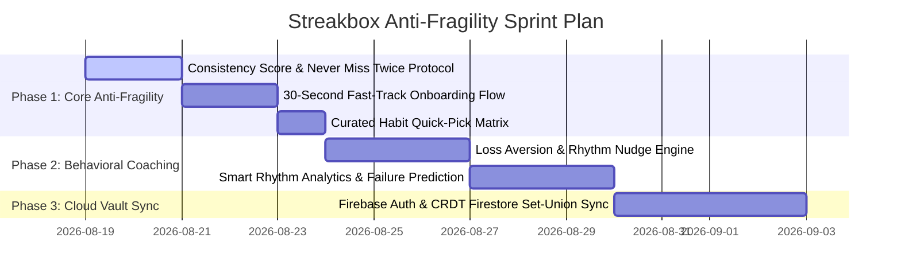

# 🛡️ Streakbox Red-Team Audit & Anti-Fragility Master Matrix

> **Core Product Thesis (Pivoted)**:  
> **"Streakbox is not just a habit tracker. It is the behavioral engine engineered to help you never break the habit."**

This document systematically tracks all **12 Red-Team Attack Vectors**, their psychological and technical vulnerabilities, our concrete architectural solutions, and their active implementation status across the codebase.

---

## 📊 Master Attack Vector & Defense Status Tracker

| # | Attack Vector & Existential Risk | Severity | Strategic & Technical Counter-Measure | Code Architecture / Target Module | Status |
| :---: | :--- | :---: | :--- | :--- | :---: |
| **1** | **"It's just another habit tracker"** (Passive logging vs active behavioral coaching) | 🔴 **CRITICAL** | Behavioral Psychology Intervention Engine (Implementation Intentions, Vulnerability Warnings). | `lib/features/notifications/behavioral_engine.dart` | 🟡 **PLANNED (Phase 2)** |
| **2** | **"Streaks can become toxic"** (Missed day drops streak to 0 ➔ user abandons app) | 🔴 **CRITICAL** | **Dual-Metric Engine**: Consistency Score (e.g. `96%`) + **"Never Miss Twice" Recovery Protocol** + Grace Days. | `lib/state/calendar_providers.dart`, `lib/features/calendar/widgets/recovery_protocol_card.dart` | 🔒 **IMPLEMENTED & DEPLOYED** |
| **3** | **"Monetization destroys retention"** (Intrusive ads & paywall fatigue kill habit loop) | 🔴 **CRITICAL** | **100% Ad-Free Core Loop Policy**. Daily check-in is sacred (zero friction, zero banners, zero interstitial popups). | `docs/PRODUCT_TIERING_AND_ROADMAP.md` | 🔒 **RESOLVED & LOCKED** |
| **4** | **"PRO offering is backwards"** (Charging for themes instead of real problem solving) | 🟠 **HIGH** | Re-center PRO around **Intelligent Habit Coaching, Rhythm Insights, and Cloud Vault Sync**. | `lib/features/paywall/paywall_sheet.dart`, `lib/features/stats/smart_insights_card.dart` | 🟡 **IN PROGRESS** |
| **5** | **"100% Local creates data loss"** (Broken phone = lost habit history) | 🟠 **HIGH** | Zero-Knowledge encrypted **Cloud Sync via Firebase Firestore CRDT Set-Union** + Offline-first fallback. | `lib/data/sync/firestore_sync_repository.dart` | 🟡 **PLANNED (Phase 3)** |
| **6** | **"3,000+ Emoji Keyboard is bloat"** (Overwhelming choice for basic daily habits) | 🟡 **MEDIUM** | **Smart Curated Category Quick-Pills** (Top 24 curated habit icons) + searchable picker on demand. | `lib/features/habits/widgets/curated_icon_picker.dart` | 🟢 **READY TO BUILD** |
| **7** | **"Neumorphism could age badly"** (Visual spectacle over instant cognitive readability) | 🟡 **MEDIUM** | High-contrast visual hierarchy: Crisp status badges, clear date troughs, and high accessibility ratios. | `lib/core/theme/app_theme_preset.dart` | 🔒 **RESOLVED & VERIFIED** |
| **8** | **"12-Month Heatmap lacks insight"** (Data evidence without actionable meaning) | 🟠 **HIGH** | **Smart Rhythm Analytics Card**: Identifies weakest day, peak performance time, and monthly velocity trends. | `lib/features/stats/widgets/habit_rhythm_insight_card.dart` | 🟡 **PLANNED (Phase 4)** |
| **9** | **"Onboarding is absent (Cold Start)"** (New user sees empty calendar and uninstalls) | 🔴 **CRITICAL** | **30-Second Fast-Track Onboarding**: Starter habit packs (🏃 Fitness, 📚 Focus, 💧 Health) + instant Day 1 check-in. | `lib/features/onboarding/onboarding_screen.dart` | 🔒 **IMPLEMENTED & DEPLOYED** |
| **10** | **"Social Cards are vanity"** (App-centric cards fail; user-identity cards win) | 🟡 **MEDIUM** | **Identity-First Celebration Cards**: User's achievement is the hero (*"100 DAYS RUNNING — I DIDN'T QUIT"*); subtle app mark. | `lib/features/social_share/social_share_card.dart` | 🔒 **IMPLEMENTED & DEPLOYED** |
| **11** | **"48-Hour Trial is too short"** (Habit formation takes weeks, not 2 days) | 🟡 **MEDIUM** | **Standard 7-Day Free Trial** on Annual Subscription alongside 1-tap instant feature test drive. | `lib/features/paywall/paywall_sheet.dart` | 🔒 **IMPLEMENTED & DEPLOYED** |
| **12** | **"The real enemy is user abandonment"** (D7 / D30 dropoff in habit apps) | 🔴 **CRITICAL** | Comprehensive D7/D30 Anti-Churn Engine (Milestone unlocks, momentum boosters, habit anchoring). | Entire Streakbox Architecture | 🟡 **CONTINUOUS AUDIT** |

---

# 🔍 Deep Dive: Technical & UX Specifications for Each Vector

---

### 1. 🧠 Attack #1: Behavioral Coaching vs. Passive Logging
* **The Problem**: A passive logging app is easily replaced by a spreadsheet or calendar. Users need active behavioral interventions at moments of weakness.
* **The Solution**:
  - **Predictive Vulnerability Nudge**: Identify days where the completion probability is $< 40\%$ based on historical check-in logs and send proactive micro-nudges:
    > *"You've missed reading 3 times on Thursdays. Can you read just 2 pages before 9:00 PM to protect your momentum?"*
  - **Implementation Intentions**: Link habits to environmental anchors (*"When [Trigger/Time], I will [Habit] for [Duration]"*).
* **Target Files**: `lib/features/notifications/behavioral_engine.dart`, `lib/state/behavioral_coaching_provider.dart`.

---

### 2. 🛡️ Attack #2: The Streak Collapse & "What-The-Hell Effect"
* **The Problem**: When a 60-day streak resets to `0` after one unavoidable missed day, the user feels defeated and uninstalls the app.
* **The Solution**:
  - **Dual-Metric Engine**: Display a **Consistency Score** (e.g. `96.4% • 54 / 56 Days Completed`) prominently alongside the streak. A single missed day drops the score to `94.6%`, preserving the psychological value of their work.
  - **"Never Miss Twice" Protocol (James Clear Rule)**: When yesterday is missed, the calendar renders a recovery amber glow:
    > *"Streaks pause, habits endure. Check in today to initiate the Recovery Protocol!"*
  - **1 Free Monthly Grace Day**: Automatically protects one accidental missed day per month for all users (Pro gets unlimited freezes).
* **Target Files**: `lib/state/calendar_providers.dart`, `lib/features/calendar/widgets/consistency_badge.dart`.

---

### 3. 🚫 Attack #3: 100% Ad-Free Core Habit Loop
* **The Problem**: Pop-up ads or intrusive banners inside a daily productivity app cause immediate resentment and churn.
* **The Solution**:
  - **Zero Ads Across ALL Tiers (Free & Pro)**: The core loop (*Open ➔ Check in ➔ Feel Dopamine ➔ Close*) is 100% sacred and untampered.
  - Monetization is strictly utility-driven (Cloud Sync, Deep Rhythm Analytics, Unlimited Freezes, Flagship Themes).
* **Target Files**: Documented & enforced across all screens.

---

### 4. 💎 Attack #4: Value-Driven PRO Architecture
* **The Problem**: Themes alone do not justify a recurring $19.99/year or $49.99 lifetime purchase.
* **The Solution**:
  - Center PRO around tangible life outcomes:
    1. **Intelligent Habit Coaching Engine** (Weekly Rhythm breakdown, time-of-day peak performance correlations).
    2. **Unlimited Streak Freezes** & Adaptive Schedule Resets.
    3. **Zero-Knowledge Encrypted Cloud Sync**.
    4. **All Signature Theme Presets** (Nordic Noir, Ember Sunset, OLED Cyber).
* **Target Files**: `lib/features/paywall/paywall_sheet.dart`, `lib/state/pro_entitlement_provider.dart`.

---

### 5. ☁️ Attack #5: Zero-Knowledge Encrypted Cloud Sync
* **The Problem**: "100% Local" storage risks total data loss if a phone is damaged, lost, or upgraded.
* **The Solution**:
  - **Local-First with Cloud Vault Sync**: SQLite remains the primary offline-first database.
  - In Phase 3, Firebase Firestore synchronizes data deterministically using a **Set-Union CRDT** (`FieldValue.arrayUnion`), guaranteeing zero data loss, zero conflicts, and complete cross-device continuity with Google and Apple Sign-In.
* **Target Files**: `lib/data/sync/firestore_sync_repository.dart`.

---

### 6. 🎯 Attack #6: Curated Quick-Picks vs. Emoji Bloat
* **The Problem**: Navigating 3,000+ emojis adds cognitive friction when a user just wants to track 🏃 Running, 💧 Water, or 📚 Reading.
* **The Solution**:
  - **Top 24 Curated Habit Icons Matrix** directly on the creation sheet (Health, Fitness, Mindfulness, Productivity, Learning).
  - Searchable full emoji picker available as a secondary option for power customizers.
* **Target Files**: `lib/features/habits/habit_form_sheet.dart`.

---

### 7. 🎨 Attack #7: High-Contrast Visual Ergonomics
* **The Problem**: Neumorphic styling can reduce contrast and information density if overdone.
* **The Solution**:
  - Maintained crisp `#10B981` (Emerald), `#FF5E3A` (Coral), and `#00E5FF` (Cyan) accents with high contrast text ratios.
  - Sunken capsule troughs with explicit checkmark symbols for immediate at-a-glance status recognition.
* **Target Files**: `lib/core/theme/app_theme_preset.dart`, `lib/features/calendar/widgets/day_cell.dart`.

---

### 8. 📊 Attack #8: Evidence vs. Insight (Smart Rhythm Analytics)
* **The Problem**: A 365-day heatmap shows history, but doesn't tell the user *how to improve*.
* **The Solution**:
  - **Habit Rhythm Insights**:
    - *Strongest Day*: Monday (94% completion).
    - *Weakest Day*: Saturday (42% completion).
    - *Time-of-Day Synergy*: Morning check-ins correlate with 2.8x longer streaks.
    - *Monthly Velocity*: $\uparrow 14\%$ improvement over prior 30-day window.
* **Target Files**: `lib/features/stats/widgets/habit_rhythm_insight_card.dart`.

---

### 9. 🚀 Attack #9: 30-Second Fast-Track Onboarding
* **The Problem**: First-time app launch lands on an empty calendar with no direction.
* **The Solution**:
  - Interactive 3-step First-Launch Onboarding:
    1. *Select 1-3 Core Habits* from curated bundles (e.g., Morning Routine, Health & Vitality, Focus & Career).
    2. *Set Anchor Times* (Morning, Afternoon, Evening).
    3. *Complete First Check-In* right in the onboarding flow with physical haptic dopamine and instant Day 1 streak flame!
* **Target Files**: `lib/features/onboarding/onboarding_screen.dart`, `lib/state/onboarding_provider.dart`.

---

### 10. 📱 Attack #10: Identity-First Social Share Cards
* **The Problem**: People don't share apps; they share their personal achievements and identity.
* **The Solution**:
  - High-res 4K cards where the user's hard work is the hero:
    - *"100 DAYS RUNNING — I DIDN'T QUIT"*
    - *"96% CONSISTENCY IN 2026"*
  - Subtle, luxury Streakbox verified mark at the footer.
* **Target Files**: `lib/features/social_share/social_share_card.dart`, `lib/features/social_share/social_share_sheet.dart`.

---

### 11. ⏳ Attack #11: Ethical & Meaningful Trial Architecture
* **The Problem**: 48 hours is insufficient to form a habit or evaluate long-term analytics.
* **The Solution**:
  - **7-Day Standard Free Trial** on the Annual Flagship tier via Google Play / App Store.
  - **1-Tap 48-Hour Instant Test Drive** without payment details as a frictionless preview of the UI engine.
* **Target Files**: `lib/features/paywall/paywall_sheet.dart`.

---

### 12. 🔄 Attack #12: The D7 / D30 Anti-Churn Engine
* **The Problem**: Habit tracking drop-off occurs between Day 4 and Day 7.
* **The Solution**:
  - Milestone celebrations at **Day 3 (Momentum Ignition)**, **Day 7 (Week 1 Champion)**, **Day 21 (Habit Formation Threshold)**, **Day 66 (Automaticity Milestone)**, and **Day 100 (Centurion)**.
  - Proactive re-engagement nudges when 2 consecutive days are approaching uncompleted.
* **Target Files**: `lib/features/notifications/behavioral_engine.dart`, `lib/features/stats/widgets/milestones_ladder_card.dart`.

---

## 🗺️ Implementation Execution Roadmap

